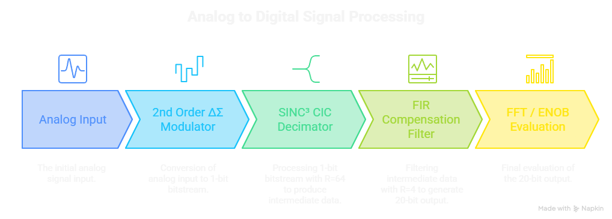
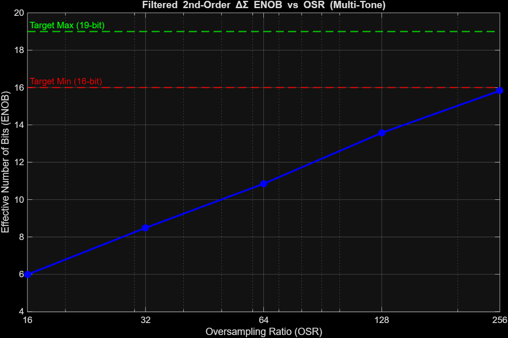
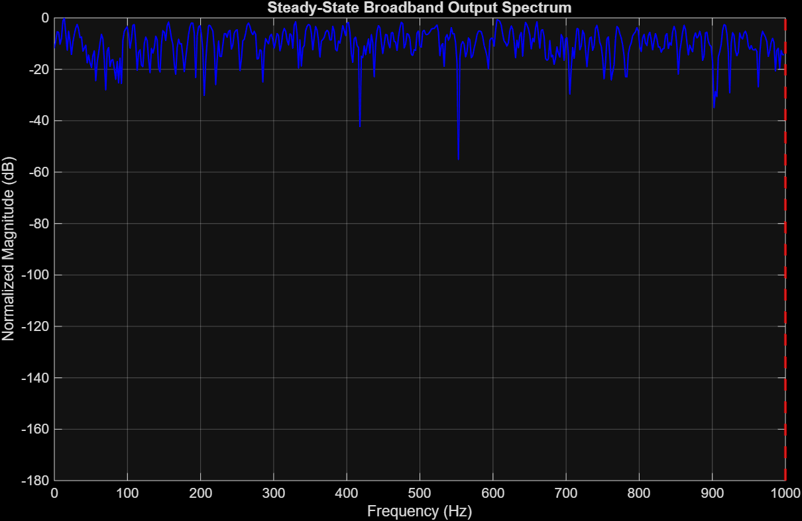
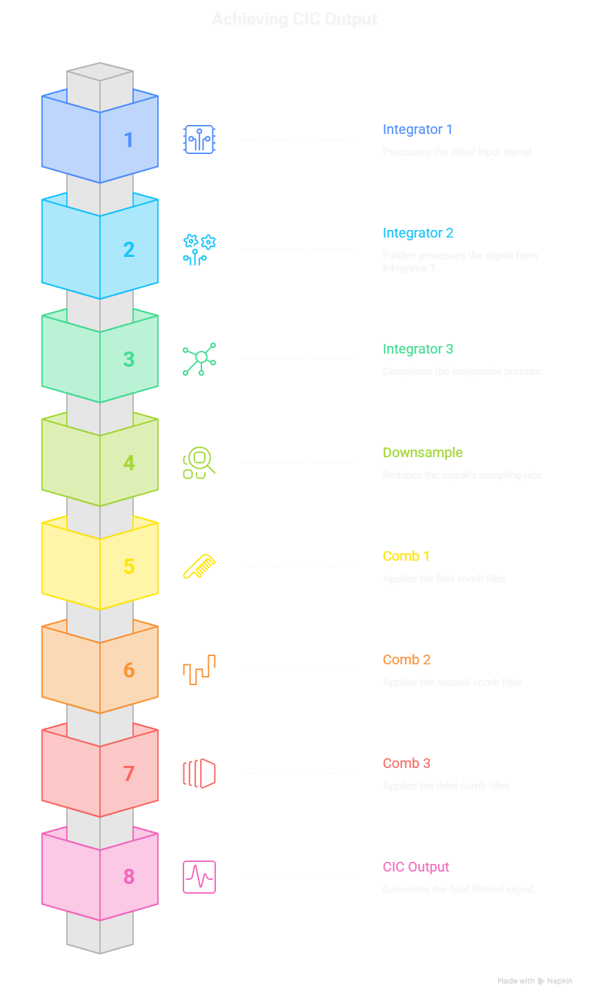
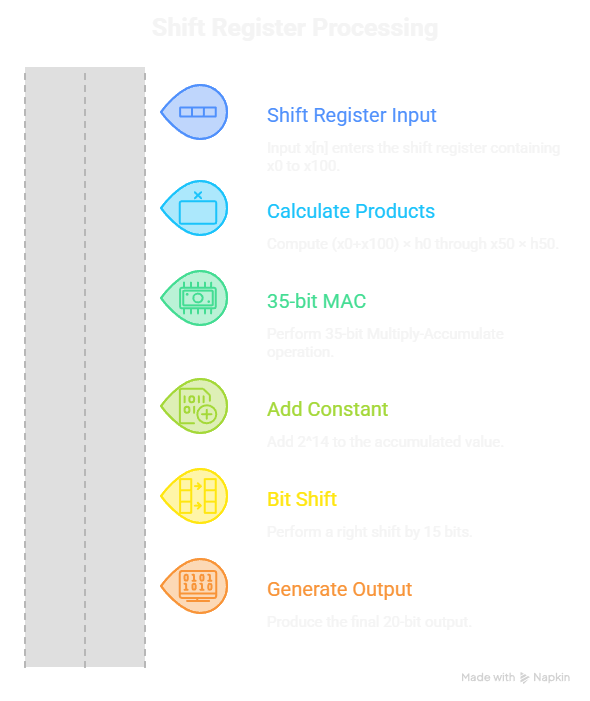
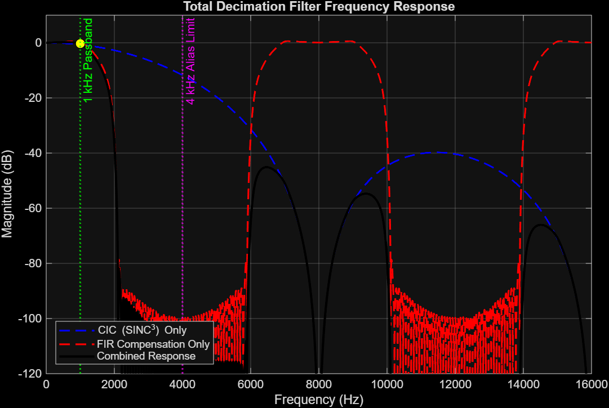
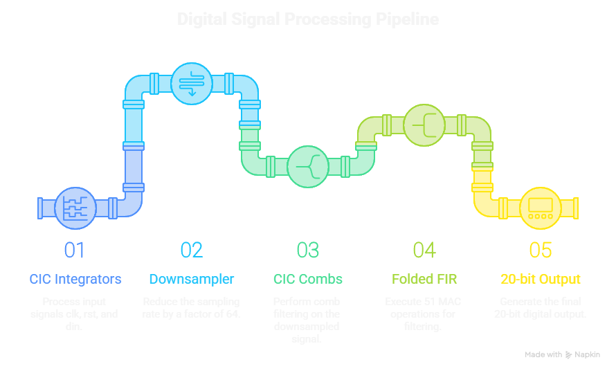
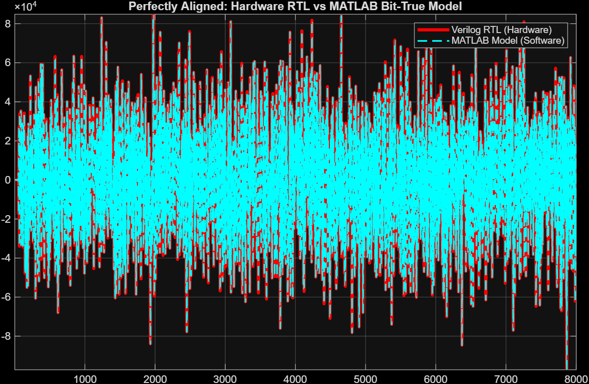
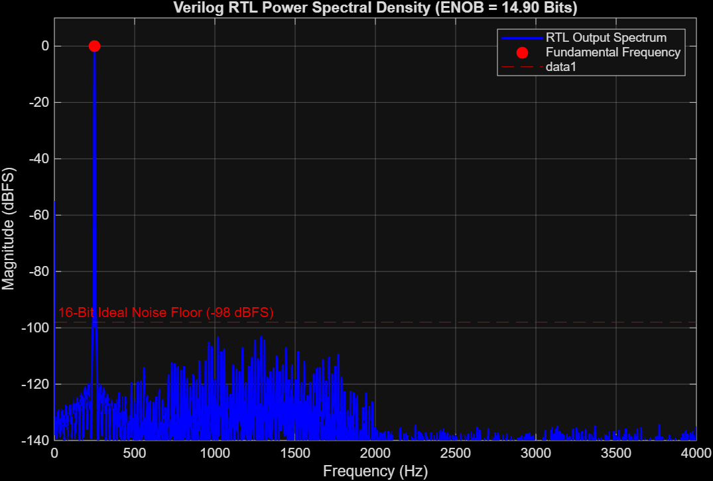

# 20-bit Delta-Sigma ADC: Behavioral Modeling, Fixed-Point Design & RTL Implementation

## Project Status

- ✅ Behavioral Modeling Complete
- ✅ Fixed-Point Design Complete
- ✅ RTL Implementation Complete
- ✅ Bit-Exact Verification Complete
- ✅ Hardware Performance Evaluation Complete

A complete end-to-end implementation of a **single-bit 2nd-order Delta-Sigma Analog-to-Digital Converter (ΔΣ ADC)**, including behavioral modeling, fixed-point hardware conversion, Verilog RTL implementation, and bit-exact hardware verification.

The project follows a complete DSP hardware design flow:

```
Analog Signal
→ Delta-Sigma Modulator
→ CIC Decimation Filter
→ FIR Compensation Filter
→ 20-bit Digital Output
→ MATLAB ↔ Verilog Bit-True Verification
```

---

# Project Overview

This project implements a hardware-efficient **2nd-order single-bit Delta-Sigma ADC** capable of producing a **20-bit digital output** while achieving approximately **15-bit Effective Number of Bits (ENOB)** under hardware-realistic fixed-point conditions.

The implementation includes:

- Behavioral Delta-Sigma Modulator
- Multi-tone & Broadband Validation
- CIC Decimation Filter
- FIR Compensation Filter
- Fixed-Point Quantization
- Hardware Register Sizing
- Verilog RTL
- Bit-Exact MATLAB ↔ RTL Verification
- FFT-Based Hardware Performance Evaluation

## Key Features

- End-to-end Delta-Sigma ADC design flow from behavioral modeling to RTL implementation.
- Second-order single-bit discrete-time ΔΣ modulator.
- Multi-stage decimation using **SINC³ CIC (R = 64)** and **FIR Compensation (R = 4)**.
- Hardware-efficient folded FIR architecture reducing multipliers from **101 to 51**.
- Complete fixed-point conversion including 19-bit CIC wraparound and 35-bit MAC accumulation.
- Bit-exact MATLAB ↔ Verilog RTL verification with **0 LSB steady-state discrepancy**.
- FFT-based hardware performance evaluation and ENOB characterization.

---

# System Architecture

<p align="center">

</p>

## Design Specifications

| Parameter | Value |
|-----------|------:|
| ADC Architecture | Second-Order Single-Bit ΔΣ |
| Output Resolution | 20-bit |
| Master Clock | 512 kHz |
| Target ENOB | 16-bit Class |
| Behavioral Floating-Point ENOB ≈ 15.83 bits | ~15.83 bits |
| Hardware ENOB | ~14.90 bits |
| Oversampling Ratio | 256 |
| CIC Filter | SINC³ (R = 64) |
| FIR Filter | Compensation FIR (R = 4) |
| CIC Register Width | 19 bits |
| FIR MAC Width | 35 bits |
| FIR Coefficient Format | Q1.15 |

Pipeline:

```
Analog Input
      │
      ▼
2nd Order ΔΣ Modulator
      │
1-bit Bitstream
      │
      ▼
SINC³ CIC Decimator (R = 64)
      │
      ▼
Compensation FIR (R = 4)
      │
      ▼
20-bit Digital Output
      │
      ▼
FFT / ENOB Evaluation
```

---

## Design Flow

```
Behavioral Model
        │
        ▼
Architecture Selection
        │
        ▼
Fixed-Point Conversion
        │
        ▼
RTL Implementation
        │
        ▼
MATLAB ↔ RTL Verification
        │
        ▼
Hardware Performance Evaluation
```


# Phase 1 — Behavioral Modeling

Implemented

- First-order Delta-Sigma Modulator
- Second-order Delta-Sigma Modulator
- OSR Sweep
- ENOB Characterization
- Architecture Selection

Validation

- Multi-tone testing
- Broadband testing
- Clock scaling verification
- Architecture comparison

Output

- Selected **2nd-order single-bit architecture**
- Behavioral Floating-Point ENOB ≈ 15.83 bits ≈ **15.83 bits**

## ENOB Characterization

<p align="center">

</p>

The ENOB sweep demonstrates the improvement obtained through oversampling and confirms that the selected second-order architecture satisfies the design objective near **OSR = 256**.

---

## Broadband Validation

<p align="center">

</p>

Broadband verification validates the noise-shaping behavior of the ΔΣ modulator using filtered white-noise excitation.

---

# Phase 2 — Fixed-Point Hardware Design

Designed

- SINC³ CIC Filter
- FIR Compensation Filter
- Register Width Analysis
- Fixed-Point Quantization
- Q1.15 FIR Coefficients

Implemented

- 19-bit CIC datapath
- 35-bit FIR MAC
- Folded symmetric FIR
- 20-bit output rounding

### Hardware Optimizations

- Folded symmetric FIR implementation
- Multiplier reduction: **101 → 51**
- 19-bit CIC datapath sizing
- 35-bit MAC accumulator
- Hardware-equivalent rounding

Verification

- Hogenauer wraparound proof
- Quantization sweep
- Passband droop analysis
- Stopband attenuation
- Bit-true MATLAB model

## CIC Architecture

<p align="center">

</p>

The CIC stage performs the first decimation by **64×** using a multiplier-free SINC³ architecture.

---

## FIR Compensation Architecture

<p align="center">

</p>

A folded symmetric FIR implementation reduces the hardware complexity from **101 multipliers** to **51 multipliers** while preserving the required response.

---

## Frequency Response

<p align="center">

</p>

The compensation FIR corrects the passband droop introduced by the CIC filter while providing strong stopband attenuation.

---

# Phase 3 — Verilog RTL Implementation

| Module | Function |
|---------|----------|
| `cic_integrator_stage.v` | CIC Integrator Stage |
| `cic_comb_stage.v` | CIC Comb Stage |
| `cic_top.v` | Complete CIC Decimator |
| `fir_compensation_stage.v` | Folded FIR Compensation Filter |
| `adc_backend_top.v` | Top-Level ADC Backend |
| `tb_adc_backend.v` | RTL Testbench |

RTL Features

- Fully synchronous design
- Folded FIR architecture
- 19-bit CIC datapath
- 35-bit accumulator
- Hardware rounding
- Verilog coefficient memory

## RTL Pipeline

<p align="center">

</p>

The RTL implementation directly follows the fixed-point architecture validated in MATLAB.

---

# Phase 4 — Hardware Verification

Verification flow

```
MATLAB

↓

Generate 1-bit Stimulus

↓

Vivado RTL Simulation

↓

RTL Output

↓

MATLAB Bit-True Comparison

↓

FFT

↓

ENOB
```

Verification Results

- MATLAB ↔ RTL comparison
- Zero steady-state discrepancy
- Bit-exact fixed-point implementation

## MATLAB ↔ RTL Verification

<p align="center">

</p>

### Verification Summary

✔ RTL matches MATLAB bit-true model exactly.

✔ Maximum steady-state discrepancy = **0 LSB**

✔ Hardware implementation preserves fixed-point ENOB.

✔ Complete functional verification performed in Vivado.


The Verilog RTL reproduces the MATLAB bit-true model exactly, confirming functional correctness of the hardware implementation.

---

## RTL Hardware Performance

<p align="center">

</p>

FFT-based evaluation of the RTL output confirms the expected spectral characteristics and measured hardware ENOB.

---

# Innovation

Several hardware-oriented optimizations were implemented to improve computational efficiency while preserving numerical accuracy:

- Folded symmetric FIR implementation reducing multipliers from **101 to 51**.
- Exact 19-bit Hogenauer wraparound implementation for the CIC filter.
- Hardware-equivalent 35-bit MAC accumulator.
- Round-to-nearest output logic instead of simple truncation.
- Complete bit-true MATLAB reference matching the Verilog RTL with **0 LSB steady-state error**.


# Results

| Metric | Behavioral | Bit-True | RTL |
|---------|-----------:|----------:|----:|
| Modulator | 2nd Order | 2nd Order | 2nd Order |
| OSR | 256 | 256 | 256 |
| CIC | SINC³ | SINC³ | SINC³ |
| FIR | Compensation | Compensation | Compensation |
| CIC Width | — | 19 bits | 19 bits |
| FIR MAC | — | 35 bits | 35 bits |
| FIR Multipliers | — | 51 | 51 |
| ENOB | 15.83 bits | 14.90 bits | 14.90 bits |
| MATLAB ↔ RTL Error | — | — | **0 LSB** |

---


# How to Run

## Execution Order

### Phase 1

1. `main_adc_behavioral.m`
2. `main_adc_sweep.m`
3. `main_adc_broadband.m`

### Phase 2

1. `fixed_point_Verification.m`
2. `design_cic_comp_fir.m`
3. `filter_freq_response.m`
4. `final_quantization_Exp.m`

### Phase 3

1. `sin_wave.m`
2. Run Vivado Simulation
3. `enob_eval.m`


# Tools Used

- MATLAB
- Signal Processing Toolbox
- Verilog HDL
- Xilinx Vivado

---

# Future Work

- Third-order ΔΣ Modulator
- MASH Architecture
- FPGA Implementation
- Timing Closure
- Resource Utilization Analysis
- Gate-Level Verification

---

## Notes


Architecture illustrations were generated using AI-assisted design tools and edited to match the implemented Delta-Sigma ADC architecture.

# References

1. Richard Schreier and Gabor C. Temes, *Understanding Delta-Sigma Data Converters*. IEEE Press/Wiley-Interscience, 2005.

2. Eugene B. Hogenauer, **"An Economical Class of Digital Filters for Decimation and Interpolation,"** *IEEE Transactions on Acoustics, Speech, and Signal Processing*, vol. ASSP-29, no. 2, pp. 155–162, Apr. 1981.

3. John G. Proakis and Dimitris G. Manolakis, *Digital Signal Processing: Principles, Algorithms, and Applications*, 4th Edition, Pearson Education.

4. All About Circuits, **"Delta-Sigma ADC"**.  
   https://www.allaboutcircuits.com/textbook/digital/chpt-13/delta-sigma-adc/

5. Analog Devices, **System Applications Guide – Section 14: Oversampling and Sigma-Delta Converters**.  
   https://www.analog.com/media/en/training-seminars/design-handbooks/system-applications-guide/Section14.pdf

---

# Author

**Vishal Boliwal**

B.Tech. IC Design &  Technology

Indian Institute of Technology Gandhinagar

Class of 2028
